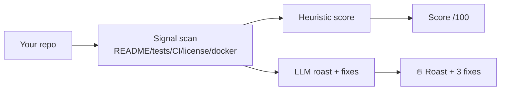

<a name="top"></a>
<div align="center">

# repo-roast 🔥

### Point an AI at your repo and let it roast you — then hand you 3 concrete fixes. Local, free, savage.

[](LICENSE)  [](https://github.com/cognis-digital/cognis-neural-suite)

`#developer-tools` `#ai` `#fun` `#code-review` `#llm`

</div>

```bash
pip install "git+https://github.com/cognis-digital/repo-roast.git"
repo-roast .                 # uses a local model (uncensored-fleet) if running
repo-roast . --no-llm        # heuristic-only roast, no model needed
```

## Architecture



## Use it from any AI stack
Talks to any **OpenAI-compatible** endpoint (default: [uncensored-fleet](https://github.com/cognis-digital/uncensored-fleet) `uncensored` slot); set `ROAST_ENDPOINT`. Works MCP-side too via JSON.

<a name="verification"></a>
## Verification

[](AUDIT.md)

Every push is verified end-to-end. Latest audit (2026-06-13):

```text
tests        : 1 passed, 0 failed, 0 errored
compile      : all modules parse
cli          : C:\Python314\python.exe: No module named https
package      : https
```

<details><summary>CLI surface (<code>--help</code>)</summary>

```text
C:\Python314\python.exe: No module named https
```
</details>

Full machine-readable results: [`AUDIT.md`](AUDIT.md) · regenerate with `python -m https --help` + `pytest -q`.

<div align="right"><a href="#top">↑ back to top</a></div>


## Related
[🤖 uncensored-fleet](https://github.com/cognis-digital/uncensored-fleet) · [📝 readme tooling in the suite](https://github.com/cognis-digital/cognis-neural-suite)

> ### ⭐ Star it, then go fix your README.

## License
COCL v1.0 — see [LICENSE](LICENSE).
