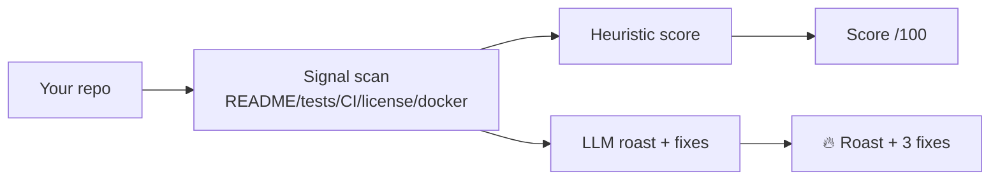

<a name="top"></a>
<div align="center">

# repo-roast 🔥

### Point an AI at your repo and let it roast you — then hand you 3 concrete fixes. Local, free, savage.

[](LICENSE)  [](https://github.com/cognis-digital/cognis-neural-suite)

`#developer-tools` `#ai` `#fun` `#code-review` `#llm`

</div>

```bash
pip install cognis-repo-roast
repo-roast .                 # uses a local model (uncensored-fleet) if running
repo-roast . --no-llm        # heuristic-only roast, no model needed
```

## Usage — step by step

1. **Install** the console script (PyPI name `cognis-repo-roast`, command `repo-roast`):
   ```bash
   pip install cognis-repo-roast
   ```
2. **Roast a repo.** The single positional argument is a path (defaults to `.`). With a local model running it uses the LLM; otherwise add `--no-llm`:
   ```bash
   repo-roast .                 # roast the current repo
   repo-roast ../some-project --no-llm   # heuristic-only, no model
   ```
3. **Get machine-readable output** for scripting — `--format json` prints the score and roast as JSON:
   ```bash
   repo-roast . --no-llm --format json > roast.json
   ```
4. **Read the result.** The JSON object contains `score` (0–100) and `roast` (the text + fixes). Pull the score out, e.g.:
   ```bash
   python -c "import json;print(json.load(open('roast.json'))['score'])"
   ```
5. **Wire it into CI** to track repo hygiene over time:
   ```yaml
   - run: pip install cognis-repo-roast
   - run: repo-roast . --no-llm --format json | tee roast.json
   ```
   Point it at any OpenAI-compatible endpoint via `ROAST_ENDPOINT` to enable the LLM roast in CI.

## Architecture



## Use it from any AI stack
Talks to any **OpenAI-compatible** endpoint (default: [uncensored-fleet](https://github.com/cognis-digital/uncensored-fleet) `uncensored` slot); set `ROAST_ENDPOINT`. Works MCP-side too via JSON.

## Related
[🤖 uncensored-fleet](https://github.com/cognis-digital/uncensored-fleet) · [📝 readme tooling in the suite](https://github.com/cognis-digital/cognis-neural-suite)

> ### ⭐ Star it, then go fix your README.

## Interoperability

`repo-roast` composes with the 300+ tool Cognis suite — JSON in/out and a shared
OpenAI-compatible `/v1` backbone. See **[INTEROP.md](INTEROP.md)** for the
suite map, composition patterns, and reference stacks.

## Integrations

Forward `repo-roast`'s findings to STIX/MISP/Sigma/Splunk/Elastic/Slack/webhooks via
[`cognis-connect`](https://github.com/cognis-digital/cognis-connect). See **[INTEGRATIONS.md](INTEGRATIONS.md)**.

## License
COCL v1.0 — see [LICENSE](LICENSE).
