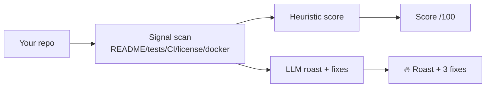

<a name="top"></a>
<div align="center">

# repo-roast 🔥

### Point an AI at your repo and let it roast you — then hand you 3 concrete fixes. Local, free, savage.

[](LICENSE)  [](https://github.com/cognis-digital/cognis-neural-suite)

`#developer-tools` `#ai` `#fun` `#code-review` `#llm`

</div>

```bash
pip install "git+https://github.com/cognis-digital/repo-roast.git"
repo-roast .                 # uses a local model (uncensored-fleet) if running
repo-roast . --no-llm        # heuristic-only roast, no model needed
```

<!-- cognis:layman:start -->
## What is this?

repo-roast points an AI at your code repository and gives it a brutally honest (but helpful) review. It checks whether your project has a README, tests, a license, and other basics, then scores it out of 100 and tells you exactly what to fix. If you have a local AI model running, it generates a witty written critique; if not, it still gives you straight-talk feedback based on what it finds. It is for developers who want a quick gut-check on whether their project looks professional before sharing it with the world.
<!-- cognis:layman:end -->

## Architecture



## Use it from any AI stack
Talks to any **OpenAI-compatible** endpoint (default: [uncensored-fleet](https://github.com/cognis-digital/uncensored-fleet) `uncensored` slot); set `ROAST_ENDPOINT`. Works MCP-side too via JSON.

<a name="verification"></a>
<!-- cognis:domains:start -->
## Domains

**Primary domain:** Cloud & DevTools  ·  **JTF MERIDIAN division:** ATHENA-PRIME · COGNI-2

**Topics:** `cognis` `devtools` `cloud` `developer-tools`

Part of the **Cognis Neural Suite** — 300+ source-available tools organized across 12 domains under the JTF MERIDIAN command structure. See the [suite on GitHub](https://github.com/cognis-digital) and [jtf-meridian](https://github.com/cognis-digital/jtf-meridian) for how the pieces fit together.
<!-- cognis:domains:end -->

<!-- cognis:install:start -->
## Install

`repo-roast` is source-available (not published to PyPI) — every method below installs
straight from GitHub. Pick whichever you prefer; the one-line scripts auto-detect
the best tool available on your machine.

**One-liner (Linux / macOS):**
```sh
curl -fsSL https://raw.githubusercontent.com/cognis-digital/repo-roast/HEAD/install.sh | sh
```

**One-liner (Windows PowerShell):**
```powershell
irm https://raw.githubusercontent.com/cognis-digital/repo-roast/HEAD/install.ps1 | iex
```

**Or install manually — any one of:**
```sh
pipx install "git+https://github.com/cognis-digital/repo-roast.git"     # isolated (recommended)
uv tool install "git+https://github.com/cognis-digital/repo-roast.git"  # uv
pip install "git+https://github.com/cognis-digital/repo-roast.git"      # pip
```

**From source:**
```sh
git clone https://github.com/cognis-digital/repo-roast.git
cd repo-roast && pip install .
```

Then run:
```sh
repo-roast --help
```
<!-- cognis:install:end -->

## Verification

[](AUDIT.md)

Every push is verified end-to-end. Latest audit (2026-06-13):

```text
tests        : 1 passed, 0 failed, 0 errored
compile      : all modules parse
cli          : C:\Python314\python.exe: No module named https
package      : https
```

<details><summary>CLI surface (<code>--help</code>)</summary>

```text
C:\Python314\python.exe: No module named https
```
</details>

Full machine-readable results: [`AUDIT.md`](AUDIT.md) · regenerate with `python -m https --help` + `pytest -q`.

<div align="right"><a href="#top">↑ back to top</a></div>


## Related
[🤖 uncensored-fleet](https://github.com/cognis-digital/uncensored-fleet) · [📝 readme tooling in the suite](https://github.com/cognis-digital/cognis-neural-suite)

> ### ⭐ Star it, then go fix your README.

## License
COCL v1.0 — see [LICENSE](LICENSE).
